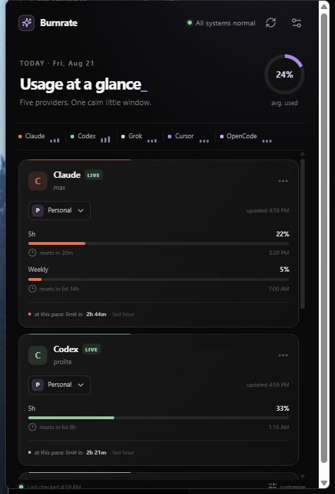
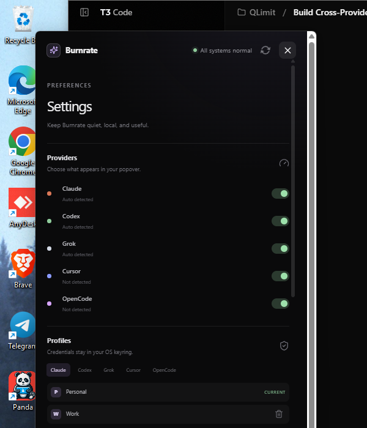
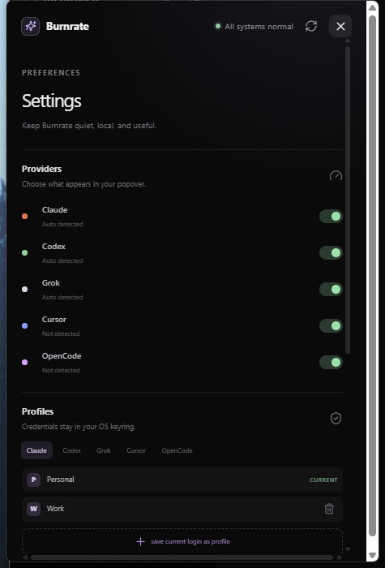

# Burnrate

Burnrate is a small, open-source system-tray popover for seeing Claude, Codex, Grok, Cursor, and
OpenCode usage limits together. It is a Tauri v2 app with a Rust backend and React + TypeScript +
Tailwind frontend. There is no account server, telemetry, analytics, or Electron layer.

## Install and run

### Windows

Download the latest Windows installer from Releases and launch Burnrate from the Start menu.
The installer is currently unsigned, so Windows SmartScreen may appear; click **More info**, then
**Run anyway** to continue.
For development, install Node.js, Rust, and the [Tauri v2 Windows prerequisites](https://v2.tauri.app/start/prerequisites/), then:

```bash
npm install
npm run tauri dev
```

### macOS

Download the signed `.dmg` from Releases, drag Burnrate to Applications, and open it. For a local
build, install Node.js, Rust, Xcode command-line tools, and the [Tauri v2 macOS prerequisites](https://v2.tauri.app/start/prerequisites/), then run the same commands above.

For a frontend-only preview (the UI uses the checked-in real fixtures when Tauri is unavailable):

```bash
npm run dev
```

Build the web bundle with `npm run build`. The Windows development target is the same code path as
macOS; provider paths are resolved from `USERPROFILE` on Windows and `HOME` elsewhere.

## How detection works

On launch Burnrate looks for the provider CLI credential files described in [PROVIDERS.md](./PROVIDERS.md):

* Claude: `~/.claude/.credentials.json` (`claude auth login`)
* Codex: `~/.codex/auth.json` (`codex login`)
* Grok: `~/.grok/auth.json` (`grok login`)
* Cursor: a cursor-agent session or the local Cursor `state.vscdb` auth record
* OpenCode: CLI auth/API configuration, then its local database fallback

The app requests usage directly from provider endpoints. Credentials are read in memory and refreshed
only through each provider's documented OAuth flow. The exact request methods, headers, response
fields, and fallback order are the implementation spec in `PROVIDERS.md`.

Cursor and OpenCode are intentionally shown as a clear login empty state when no CLI credentials are
present. The exact commands are `cursor-agent login` and `opencode auth login`.

## Multiple accounts

Use Settings → Profiles → “save current login as profile”. Burnrate snapshots the current CLI
credential material into the OS keyring under a provider/name-scoped entry, with a small keyring
index for portable enumeration. Every saved profile is refreshed independently in the background;
switching from a card is instant, and “All” stacks every saved profile for that provider. It never
writes credentials to the repository, log, fixture, or quota cache. Deleting a profile removes its
credential and index entry.

## Privacy and security

Everything stays local. Quota snapshots are cached under the platform cache directory so the popover
can open with the last known state. The cache contains quota data only, never credentials. Failed
refreshes keep the last known values and mark them stale rather than blanking a card. Burnrate never
extracts browser cookies automatically; a manual Cookie header is the only web fallback and is an
explicit Settings action.

The app makes no network calls except to the configured provider endpoints. It never logs access
tokens, refresh tokens, cookies, or raw authorization headers.

## Screenshots








## Attribution

Provider endpoint research is based on [CodexBar by Peter Steinberger](https://github.com/steipete/CodexBar),
MIT licensed. The checked-in `references/` directory is development research only and is excluded
from published builds.

## License

MIT. See [LICENSE](./LICENSE).
