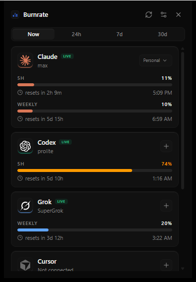
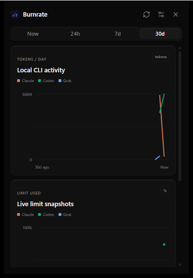
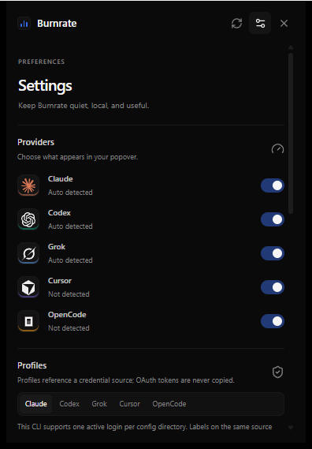
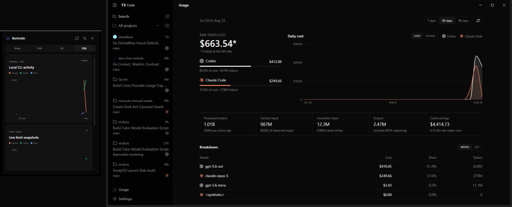
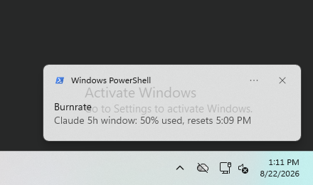

# Burnrate

Burnrate is a small, open-source system-tray popover for seeing Claude, Codex, Grok, Cursor, and
OpenCode usage limits together. It is a Tauri v2 app with a Rust backend and React + TypeScript +
Tailwind frontend. There is no account server, telemetry, analytics, or Electron layer.

## Install

Burnrate is directly logged in and synced from your existing provider CLI sessions on first
launch—there is zero setup.

### Windows

Install the current release with [Scoop](https://scoop.sh/):

```powershell
scoop install https://raw.githubusercontent.com/tovi2101/burnrate/master/packaging/scoop/burnrate.json
```

MSI and NSIS installers are also attached to each [GitHub Release](https://github.com/tovi2101/burnrate/releases).
The binaries are unsigned, so Windows SmartScreen may appear; click **More info**, then **Run
anyway**.

### macOS

The cask in `packaging/homebrew/burnrate.rb` is ready for the `tovi2101/homebrew-tap` tap:

```bash
brew install --cask tovi2101/tap/burnrate
```

The macOS build is universal (Apple Silicon and Intel). Because it is unsigned, Gatekeeper may
block its first launch. Right-click Burnrate and choose **Open**, or run:

```bash
xattr -dr com.apple.quarantine /Applications/Burnrate.app
```

### Linux

Install the latest AppImage into `~/.local/bin`:

```bash
curl -fsSL https://raw.githubusercontent.com/tovi2101/burnrate/master/packaging/install.sh | bash
```

The same release also includes a Debian package.

## Develop

Install Node.js, Rust, and the [Tauri v2 platform prerequisites](https://v2.tauri.app/start/prerequisites/), then:

```bash
npm install
npm run tauri dev
```

For a frontend-only preview (the UI uses the checked-in real fixtures when Tauri is unavailable):

```bash
npm run dev
```

Build the web bundle with `npm run build`. The Windows development target is the same code path as
macOS; provider paths are resolved from `USERPROFILE` on Windows and `HOME` elsewhere.

## How detection works

On launch Burnrate looks for the provider CLI credential files described in [PROVIDERS.md](./PROVIDERS.md):

* Claude: `~/.claude/.credentials.json` (`claude auth login`)
* Codex: `~/.codex/auth.json` (`codex login`)
* Grok: `~/.grok/auth.json` (`grok login`)
* Cursor: a cursor-agent session or the local Cursor `state.vscdb` auth record
* OpenCode: CLI auth/API configuration, then its local database fallback

The app prefers each provider CLI's local RPC or authentication command, then reads credentials
fresh from its configured source for read-only usage requests. The exact request methods, headers,
response fields, and fallback order are the implementation spec in `PROVIDERS.md`.

Cursor and OpenCode are intentionally shown as a clear login empty state when no CLI credentials are
present. The exact commands are `cursor-agent login` and `opencode auth login`.

## Real usage history

The **Now**, **24h**, **7d**, and **30d** views combine two honest units without conflating them:
quota snapshots are charted as percent used, while historical CLI activity is charted as processed
tokens per hour or day. On the first launch of this version, Burnrate asynchronously imports the
history already present in Claude Code, Codex, Grok, and OpenCode local session stores; Cursor account
history is available when its existing manual-cookie fallback is configured. The Now view never waits
for the import.

History is stored in a local SQLite database in the platform app-data directory and pruned after 180
days. Burnrate stores timestamps, provider/profile labels, usage values, plans, and provenance only.
It never copies prompts, responses, tool payloads, session contents, or credentials. See
[HISTORY.md](./HISTORY.md) for the exact per-provider source map and measured coverage.

## Multiple accounts

Open a provider's profile pill (or its **+** button) and choose **Add account**. Burnrate first
preserves the current login in an isolated provider CLI config directory, then guides you through
the provider's normal login command and detects the new identity. There is no profile cap. Duplicate
identities are rejected, switching is instant, and **All** stacks every profile vertically.

Profiles contain only a credential-source reference and account identity in the OS keyring—never a
frozen OAuth token. Claude, Codex, and Grok can safely sustain separate CLI-owned config directories;
each distinct account polls independently while duplicate references coalesce into one request.
Cursor and OpenCode do not currently expose an isolated credential source that Burnrate can delegate
refresh to safely, so their add-account dialog explains that multiple simultaneous logins are not
available instead of risking the active CLI session.

## Safety

Burnrate is a read-only observer: it reads credentials but never modifies your provider login state
or writes rotated tokens. OAuth refresh is delegated to each provider's own CLI so its credential
file remains authoritative and the coding agent stays logged in. Credential files are reread before
every poll, and profile labels that point to the same account are coalesced into one request.

## Privacy and security

Everything stays local. Quota snapshots are cached under the platform cache directory so the popover
can open with the last known state. The cache contains quota data only, never credentials. Failed
refreshes keep the last known values and mark them stale rather than blanking a card. Burnrate never
extracts browser cookies automatically; a manual Cookie header is the only web fallback and is an
explicit Settings action.

The app makes no network calls except to the configured provider endpoints. It never logs access
tokens, refresh tokens, cookies, or raw authorization headers.

## Screenshots












## Attribution

Provider endpoint research is based on [CodexBar by Peter Steinberger](https://github.com/steipete/CodexBar),
MIT licensed. The checked-in `references/` directory is development research only and is excluded
from published builds.

Provider names and marks are trademarks of their respective owners and are used for identification
only. Burnrate is not affiliated with or endorsed by any provider.

## License

MIT. See [LICENSE](./LICENSE).
